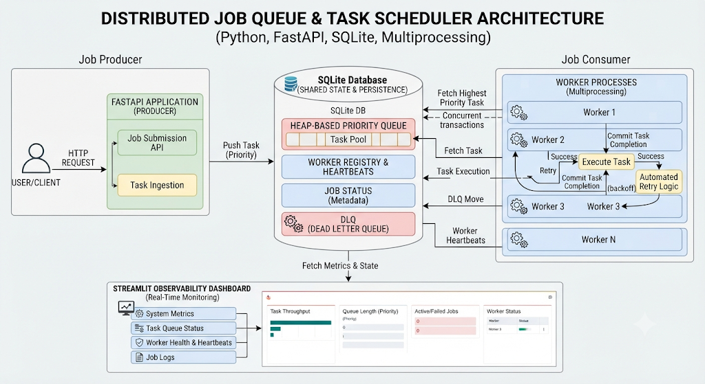
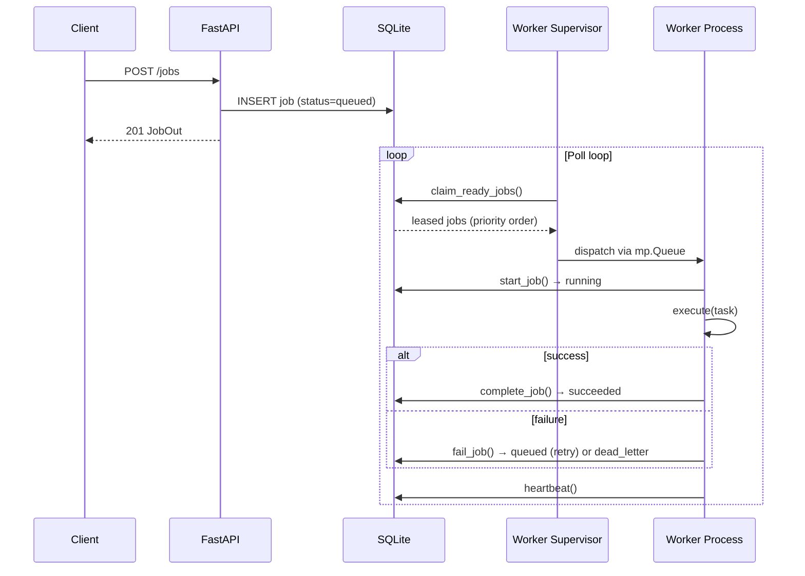

# Distributed Job Queue & Task Scheduler

A local, SQLite-backed distributed task scheduler built with **Python**, **FastAPI**, **multiprocessing**, and **Streamlit**. Jobs are submitted over HTTP, stored in a heap-based priority queue, executed by parallel worker processes, and monitored through a real-time observability dashboard.



---

## Features

| Feature | Description |
|---|---|
| **Priority scheduling** | Heap-based queue — higher `priority` runs first; ties break FIFO by creation time |
| **Parallel workers** | Configurable multiprocessing pool for concurrent task execution |
| **Automatic retries** | Exponential backoff (`2^attempt` seconds, capped at 60s) before giving up |
| **Dead Letter Queue (DLQ)** | Permanently failed jobs are moved to a dedicated DLQ table for inspection |
| **Worker heartbeats** | Workers register and periodically ping the database so you can see who is alive |
| **Graceful shutdown** | API endpoint signals workers to finish in-flight work before stopping |
| **Lease recovery** | On worker restart, orphaned `leased` jobs are re-queued automatically |
| **Observability dashboard** | Streamlit UI for queue depth, worker health, events, and DLQ entries |
| **SQLite WAL mode** | Write-ahead logging and busy timeouts for safe concurrent access |

---

## Architecture

The system has four main components that share a single SQLite database as the source of truth.

### 1. Job Producer (FastAPI)

The FastAPI application is the entry point for clients. It exposes REST endpoints to submit jobs, query status, fetch metrics, and control worker lifecycle.

```
User/Client  →  Job Submission API  →  Task Ingestion  →  SQLite DB
```

### 2. SQLite Database (Shared State)

All components read and write through the same database file (`data/scheduler.db`):

| Table | Purpose |
|---|---|
| `jobs` | Priority queue, job metadata, and lifecycle state |
| `dead_letters` | Tasks that exhausted all retry attempts |
| `workers` | Worker registry with PID, status, and heartbeat timestamps |
| `events` | Structured log of scheduler activity |
| `control` | Runtime flags (e.g. graceful shutdown) |

Jobs move through these states:

```
queued  →  leased  →  running  →  succeeded
                              ↘  queued (retry with backoff)
                                  ↘  dead_letter (DLQ)
```

### 3. Job Consumer (Multiprocessing Workers)

The worker supervisor (`app/worker.py`) spawns N child processes. Each worker:

1. **Claims** ready jobs from SQLite (status `queued`, `scheduled_at <= now`)
2. **Executes** the task handler (`echo`, `sleep`, or `fail`)
3. **Commits** success or triggers retry / DLQ on failure
4. **Heartbeats** every 2 seconds so the dashboard shows live worker status

The supervisor maintains an in-memory **min-heap** ordered by `(-priority, created_at)` and dispatches jobs to worker processes via a bounded `multiprocessing.Queue`.

### 4. Streamlit Observability Dashboard

The dashboard (`dashboard.py`) reads directly from SQLite and displays:

- Queue counters (Queued, Running, Succeeded, DLQ, Total)
- Worker heartbeats and PIDs
- Dead Letter Queue entries
- Recent scheduler events

---

## Project Structure

```
distributed_job/
├── app/
│   ├── api.py        # FastAPI routes (job submission, metrics, shutdown)
│   ├── worker.py     # Multiprocessing supervisor + task executors
│   ├── store.py      # SQLite persistence layer
│   ├── models.py     # Pydantic request/response schemas
│   └── config.py     # Paths, poll interval, heartbeat interval
├── dashboard.py      # Streamlit observability UI
├── docs/
│   └── architecture.png
├── data/             # Created at runtime — scheduler.db lives here
├── requirements.txt
└── README.md
```

---

## Quick Start

### Prerequisites

- Python 3.11+
- Windows PowerShell (commands below) or any shell with equivalent syntax

### 1. Install dependencies

```powershell
python -m venv .venv
.\.venv\Scripts\Activate.ps1
python -m pip install -r requirements.txt
```

### 2. Start the worker pool

```powershell
python -m app.worker --workers 3
```

### 3. Start the API (separate terminal)

```powershell
uvicorn app.api:app --reload
```

Interactive API docs: [http://127.0.0.1:8000/docs](http://127.0.0.1:8000/docs)

### 4. Start the dashboard (separate terminal)

```powershell
streamlit run dashboard.py
```

Dashboard URL: [http://localhost:8501](http://localhost:8501)

---

## Usage

### Submit a job

```powershell
Invoke-RestMethod -Method Post http://127.0.0.1:8000/jobs `
  -ContentType 'application/json' `
  -Body '{"task_type":"sleep","payload":{"seconds":2},"priority":10,"max_retries":2}'
```

**curl (Linux/macOS):**

```bash
curl -X POST http://127.0.0.1:8000/jobs \
  -H 'Content-Type: application/json' \
  -d '{"task_type":"sleep","payload":{"seconds":2},"priority":10,"max_retries":2}'
```

### Task types

| Type | Payload | Behavior |
|---|---|---|
| `echo` | Any JSON object | Returns the payload as the result string |
| `sleep` | `{"seconds": N}` | Sleeps for N seconds (clamped 0–30) |
| `fail` | `{"message": "..."}` | Always raises an error — useful for testing retries and DLQ |

### Job request fields

| Field | Type | Default | Description |
|---|---|---|---|
| `task_type` | `"echo" \| "sleep" \| "fail"` | — | Handler to invoke |
| `payload` | `object` | `{}` | Task-specific input |
| `priority` | `int` (0–100) | `0` | Higher values dequeue first |
| `max_retries` | `int` (0–10) | `3` | Retry attempts after the first failure |
| `scheduled_at` | ISO datetime | now | Delay execution until this time (UTC) |

### Query jobs

```powershell
# List recent jobs
Invoke-RestMethod http://127.0.0.1:8000/jobs

# Get a single job by ID
Invoke-RestMethod http://127.0.0.1:8000/jobs/<job-id>
```

### Graceful worker shutdown

```powershell
Invoke-RestMethod -Method Post http://127.0.0.1:8000/workers/shutdown
```

Workers finish their current job, then the supervisor exits. Re-enable with:

```powershell
Invoke-RestMethod -Method Post http://127.0.0.1:8000/workers/start
```

---

## API Reference

| Method | Endpoint | Description |
|---|---|---|
| `GET` | `/health` | Liveness check |
| `POST` | `/jobs` | Submit a new job (returns `201`) |
| `GET` | `/jobs` | List jobs (`?limit=100`, max 500) |
| `GET` | `/jobs/{job_id}` | Get job by ID |
| `GET` | `/metrics` | Aggregated counts, workers, events, DLQ |
| `POST` | `/workers/shutdown` | Request graceful worker shutdown |
| `POST` | `/workers/start` | Clear shutdown flag |

---

## Retry & DLQ Behavior

When a task fails:

1. The attempt counter increments.
2. If `attempts <= max_retries`, the job returns to `queued` with a new `scheduled_at`:
   - Backoff delay = `min(2^attempt, 60)` seconds
3. If retries are exhausted, the job moves to `dead_letter` status and a row is inserted into the `dead_letters` table.

Example timeline for `max_retries: 2`:

```
Attempt 1 fails  →  retry in 2s
Attempt 2 fails  →  retry in 4s
Attempt 3 fails  →  moved to DLQ
```

---

## Configuration

Settings in `app/config.py`:

| Constant | Default | Description |
|---|---|---|
| `DB_PATH` | `data/scheduler.db` | SQLite database file location |
| `POLL_SECONDS` | `0.5` | Worker supervisor poll interval |
| `HEARTBEAT_SECONDS` | `2` | Worker heartbeat frequency |

---

## How It Works (End-to-End)



---

## Tech Stack

- **[FastAPI](https://fastapi.tiangolo.com/)** — HTTP API for job ingestion
- **[SQLite](https://www.sqlite.org/)** (WAL mode) — shared persistence and queue
- **[multiprocessing](https://docs.python.org/3/library/multiprocessing.html)** — parallel worker processes
- **[Streamlit](https://streamlit.io/)** — observability dashboard
- **[Pydantic](https://docs.pydantic.dev/)** — request validation

---

## License

This project is open source. Use and modify it freely for learning and local development.
